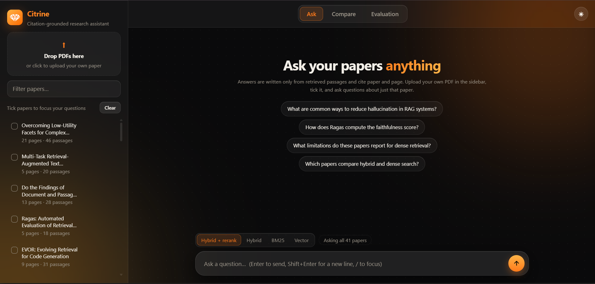
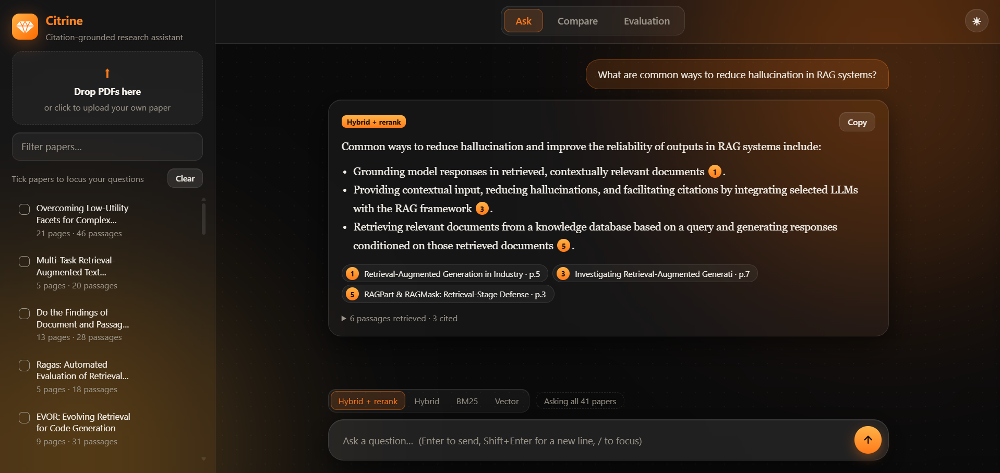
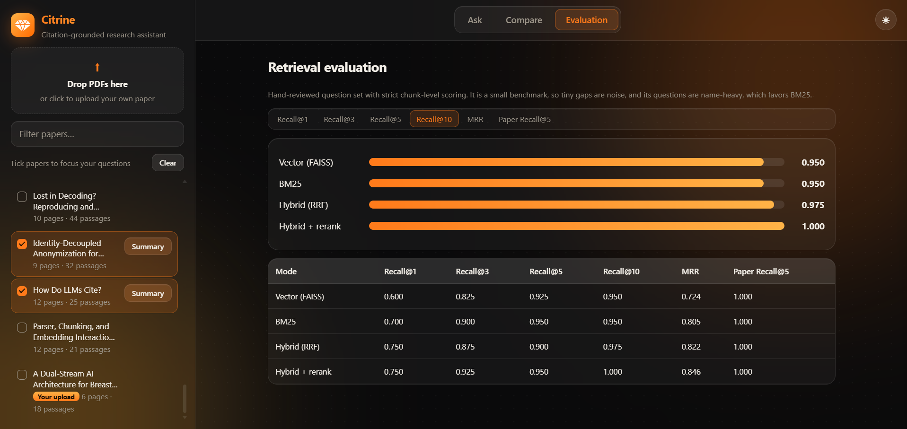
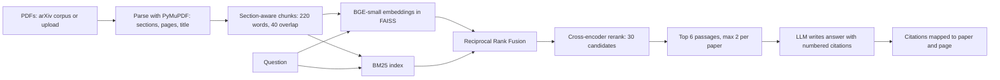

# Citrine: Academic Paper Intelligence Platform

A citation-grounded research assistant for academic papers. Upload PDFs (or use the bundled arXiv corpus), ask questions in plain language, and get answers that cite the exact paper and page they came from. Retrieval combines dense embeddings, BM25 and a cross-encoder reranker, and the pipeline is **measured rather than assumed**: a hand-reviewed benchmark compares vector, BM25, hybrid and hybrid + rerank search.






## Features

- **PDF ingestion:** section-aware parsing with PyMuPDF (title, abstract, sections, page numbers), chunking with overlap, and metadata on every chunk.
- **Hybrid retrieval:** FAISS dense search + BM25 keyword search fused with Reciprocal Rank Fusion, then reranked by a cross-encoder. All four modes can be selected in the UI.
- **Citation-grounded Q&A:** answers are written only from retrieved passages. Every claim cites a numbered passage that maps back to paper, section and page, and the system declines when the papers do not contain the answer.
- **Upload your own papers:** drop a PDF into the sidebar and ask questions about just that paper (scoped retrieval).
- **Paper summaries and comparison:** structured LLM extraction (problem, methodology, dataset, results, key findings, limitations) and side-by-side comparison tables, with "Not stated" when the text does not say.
- **Evaluation harness:** question set with gold chunks, Recall@K and MRR for every retrieval mode.
- **Web app:** FastAPI backend and a single-page interface with light and dark themes, a passage viewer drawer, and a live evaluation page.

## How it works



Design decisions:

- **Chunk metadata first.** Every chunk carries `paper_id`, `section`, `page_start` and `page_end`, so citations are possible without asking the LLM to invent them.
- **The LLM cites numbers, code resolves them.** The prompt numbers the retrieved passages; the model cites `[1]`, `[2]`, and the API maps those back to real papers and pages.
- **RRF instead of score mixing.** BM25 scores and cosine similarities are on different scales, so fusion uses ranks.
- **Diversity cap.** At most 2 passages per paper in unscoped questions, so one paper cannot dominate an answer.
- **Uploads are isolated.** Uploaded papers are added to the in-memory index at startup but never to the saved base index, so the evaluation numbers stay reproducible.
- **Free-tier friendly LLM layer.** An OpenAI-compatible client with retries and a fallback model, since free tiers are often overloaded.

## Results

Benchmark: 40 hand-reviewed questions generated from source chunks (gold = the chunk the question came from), scored at **chunk level**, which is strict because neighbouring chunks overlap in text. 1 question = 2.5 points.

| Mode | Recall@1 | Recall@3 | Recall@5 | Recall@10 | MRR | Paper Recall@5 |
|---|---|---|---|---|---|---|
| Vector (FAISS) | 0.600 | 0.825 | 0.925 | 0.950 | 0.724 | 1.000 |
| BM25 | 0.700 | 0.900 | 0.950 | 0.950 | 0.805 | 1.000 |
| Hybrid (RRF) | 0.750 | 0.875 | 0.900 | 0.975 | 0.822 | 1.000 |
| **Hybrid + rerank** | **0.750** | **0.925** | **0.950** | **1.000** | **0.846** | **1.000** |

What the numbers support:

- **Dense-only retrieval is clearly the weakest at the top of the ranking.** Hybrid and reranked search put the correct chunk first in 30 of 40 questions versus 24 for vector search (Recall@1 0.60 to 0.75, MRR 0.724 to 0.846).
- **BM25 alone is strong** (MRR 0.805), so much of the gain over dense search is the lexical signal.
- **Reranking's extra gain over plain hybrid is small** (MRR +0.024, about 1 to 2 questions) and should be treated as within noise at this sample size. On the first 42-question run, reranking showed no gain (MRR 0.808 vs 0.809 for hybrid).

<details><summary>Initial run: 42 questions, before cleaning</summary>

| Mode | Recall@1 | Recall@3 | Recall@5 | Recall@10 | MRR | Paper Recall@5 |
|---|---|---|---|---|---|---|
| Vector | 0.571 | 0.810 | 0.905 | 0.929 | 0.702 | 0.976 |
| BM25 | 0.690 | 0.905 | 0.952 | 0.952 | 0.803 | 1.000 |
| Hybrid | 0.738 | 0.857 | 0.881 | 0.976 | 0.809 | 0.976 |
| Hybrid + rerank | 0.714 | 0.881 | 0.905 | 0.952 | 0.808 | 0.976 |

Two questions were removed using stated criteria, not because the system missed them: **q027** (ambiguous, since many papers explain how RAG avoids retraining) and **q029** (its gold chunk was a copyright notice). Both result files are in `data/eval/`.
</details>

### Failure analysis

Of the four questions the best mode missed in the top 5 on the initial run:

| Question | Cause |
|---|---|
| q027 | Ambiguous question (removed) |
| q029 | Bad gold chunk: copyright boilerplate (removed) |
| q050 | Real miss: vocabulary mismatch ("recommendations for developers" vs "practitioners may consider") |
| q051 | Right paper, neighbouring chunk retrieved instead of the gold one |

All four were conceptual questions without a distinctive keyword.

## Quick start

```bash
git clone https://github.com/Rudransh0504/Academic-Paper-RAG-Assistant.git
cd Academic-Paper-RAG-Assistant
python -m venv .venv
# Windows: .venv\Scripts\activate      Mac/Linux: source .venv/bin/activate
pip install -r requirements.txt
```

Copy `.env.example` to `.env` and set `LLM_API_KEY`, `LLM_BASE_URL` and `LLM_MODEL`. Any OpenAI-compatible endpoint works (Gemini, Groq, a local Ollama server).

```bash
python scripts/download_ids.py          # the exact 40-paper corpus (data/eval/corpus_ids.txt)
python -m scripts.run_ingest            # parse and chunk
python -m scripts.build_index           # embed and index
uvicorn api.main:app                    # then open http://127.0.0.1:8000
```

Optional:

```bash
python -m scripts.run_analysis          # regenerate paper summaries (cached in data/analysis)
python -m scripts.run_eval              # reproduce the results table
```

The benchmark's gold chunk IDs are deterministic for a given PDF set and parser version, so use the paper list above rather than a fresh arXiv search.

## API

| Endpoint | Purpose |
|---|---|
| `GET /papers` | List the corpus and uploaded papers |
| `POST /upload` | Upload a PDF; it is parsed, embedded and indexed |
| `DELETE /papers/{id}` | Remove an uploaded paper |
| `POST /search` | Retrieve passages (`mode`: `vector`, `bm25`, `hybrid`, `hybrid_rerank`; optional `paper_ids`) |
| `POST /ask` | Cited answer, sources and all retrieved passages with scores |
| `GET /analysis/{id}` | Structured summary of one paper (generated on demand for uploads) |
| `POST /compare` | Comparison table and short summary for 2 to 4 papers |
| `GET /eval` | Benchmark results shown on the Evaluation page |

## Project structure

```
api/main.py            FastAPI app (also serves the web UI)
web/index.html         Single-file frontend
src/ingest/            parser.py, chunker.py
src/retrieval/         vector_store.py, bm25.py, hybrid.py, reranker.py
src/rag/               generate.py (LLM client), pipeline.py (prompt + citations)
src/analysis/          summarize.py (structured paper extraction)
scripts/               ingest, index, evaluation, review and analysis scripts
data/eval/             benchmark questions, results, corpus list
data/analysis/         cached paper summaries
```

## Limitations and known issues

- **Small benchmark.** 40 questions, so gaps of 1 to 2 questions are noise. Questions were generated from chunks and then filtered by hand, which makes them name-heavy and favours keyword search; dense retrieval and reranking are probably undersold.
- **Strict scoring.** Chunk-level metrics count a correct neighbouring chunk as a miss; paper-level recall is reported alongside.
- **Parser heuristics.** Some PDFs produce glued words (for example "corporascale"), front-matter boilerplate can leak into a chunk, section labels can go stale when headings are non-standard, and figure or table text can enter chunks. Scanned PDFs are not supported. Re-ingesting changes chunk IDs, so the benchmark would need migrating.
- **Citation correctness is not formally measured.** Spot checks showed that an answer can cite a secondary mention of a method alongside the primary source.
- **LLM summaries are unverified at scale.** They are only spot-checked, and they say "Not stated" instead of guessing.
- **Local, single-user app.** There is no authentication, and uploads are stored on disk.
- **Free-tier LLM limits.** Rate limits and overload are handled with retries and a fallback model, but answers can still be slow.

## Roadmap

- Fix the PDF spacing issue, re-ingest and migrate the benchmark
- Add conceptual (keyword-free) benchmark questions and a citation-correctness audit (supported, partial, unsupported)
- Similar-paper recommendation and research-gap analysis
- Try a stronger reranker; Docker and deployment

## Tech stack

Python, FastAPI, PyMuPDF, Sentence-Transformers (BAAI/bge-small-en-v1.5), FAISS, rank-bm25, cross-encoder/ms-marco-MiniLM-L-6-v2, an OpenAI-compatible LLM API (Gemini), vanilla HTML/CSS/JS.